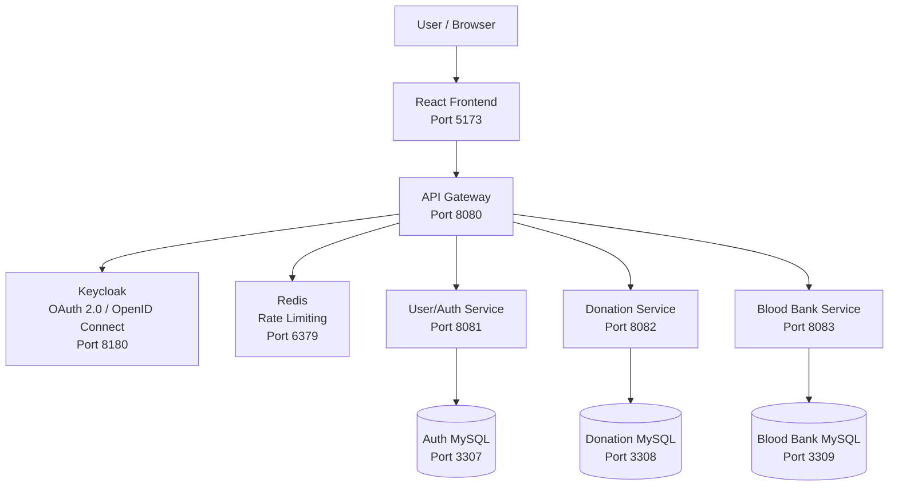

# Blood Donation Management System

A distributed microservices-based Blood Donation Management System developed as a group project for the Service-Oriented Computing module.

The system is implemented using Spring Boot microservices, Spring Cloud Gateway, React, Keycloak, Redis, MySQL, Docker, OAuth 2.0, API Key authentication, Swagger/OpenAPI, and GitHub-based collaborative development.

---

## Project Repository

Main GitHub Repository:

https://github.com/Lishani-Samarakoon/BloodDonationSystem-New

Main Branch:

https://github.com/Lishani-Samarakoon/BloodDonationSystem-New/tree/main

---

# 1. Project Overview

The Blood Donation Management System provides a unified web application for managing:

- Users and donors
- Blood donations
- Blood banks
- Blood stock
- Blood requests
- Authentication and authorization

The backend is separated into three independent Spring Boot microservices.

Each microservice:

- Provides RESTful APIs
- Uses its own database
- Implements API Key security
- Includes Swagger/OpenAPI documentation
- Runs as an independent Docker container

The React frontend communicates with the backend through a centralized API Gateway.

---

# 2. Group Members

| Member | Name | GitHub Account | Main Contribution | Branch |
|---|---|---|---|---|
| Member 1 | Lishani Samarakoon | `Lishani-Samarakoon` | User/Auth and Security | `feature/user-auth-security` |
| Member 2 | Wathsala Kithulgala | `wathsala2001` | Donation Management | `feature/donation-management` |
| Member 3 | Seshan Sandeepa | `seshansandeepa` | Blood Bank Management | `feature/bloodbank-infrastructure` |

---

# 3. Individual Contributions

## Member 1 - Lishani Samarakoon

### Main Contribution

User/Auth and Security

### GitHub Profile

https://github.com/Lishani-Samarakoon

### Contribution Branch

https://github.com/Lishani-Samarakoon/BloodDonationSystem-New/tree/feature/user-auth-security

### Main Contribution Commit

Commit:

`aaf3f7f`

Commit message:

`Complete user authentication and security service`

Commit link:

https://github.com/Lishani-Samarakoon/BloodDonationSystem-New/commit/aaf3f7f

### Responsibilities

- User/Auth microservice
- User entity and persistence
- User repository
- User service layer
- User CRUD REST APIs
- User validation
- Exception handling
- Internal API Key security
- Security configuration
- API Key filter
- Swagger/OpenAPI configuration
- Keycloak realm configuration
- User/Auth service testing
- Authentication and security-related functionality

### Main Source Folder

```text
auth-service/
```

---

## Member 2 - Wathsala Kithulgala

### Main Contribution

Donation Management

### GitHub Profile

https://github.com/wathsala2001

### Contribution Branch

https://github.com/Lishani-Samarakoon/BloodDonationSystem-New/tree/feature/donation-management

### Main Contribution Commit

Commit:

`8440ded`

Commit message:

`Complete donation service and donation management`

Commit link:

https://github.com/Lishani-Samarakoon/BloodDonationSystem-New/commit/8440ded

### Responsibilities

- Donation microservice
- Donation entity and persistence
- Donation repository
- Donation service layer
- Donation CRUD REST APIs
- Search donations by donor
- Search donations by blood group
- Search donations by status
- Donation status management
- Quantity validation
- Available-date validation
- Exception handling
- Internal API Key security
- Security configuration
- API Key filter
- Swagger/OpenAPI configuration
- Donation API integration

### Main Source Folder

```text
donation-service/
```

---

## Member 3 - Seshan Sandeepa

### Main Contribution

Blood Bank Management

### GitHub Profile

https://github.com/seshansandeepa

### Contribution Branch

https://github.com/Lishani-Samarakoon/BloodDonationSystem-New/tree/feature/bloodbank-infrastructure

### Main Contribution Commit

Commit:

`8766c61`

Commit message:

`Complete blood bank service and management`

Commit link:

https://github.com/Lishani-Samarakoon/BloodDonationSystem-New/commit/8766c61

### Responsibilities

- Blood Bank microservice
- Blood Bank CRUD REST APIs
- Blood Stock management
- Blood Stock CRUD operations
- Blood Request management
- Blood Request status management
- Repository layer
- Service layer
- Validation
- Exception handling
- Internal API Key security
- Security configuration
- API Key filter
- Swagger/OpenAPI configuration
- Blood Bank service testing
- Blood Bank integration testing

### Main Source Folder

```text
bloodbank-service/
```

---

# 4. Shared Integration Work

The following components support the complete integrated system:

```text
api-gateway/
frontend/
keycloak/
docker-compose.yml
scripts/
```

Shared integration includes:

- API Gateway integration
- OAuth 2.0 authentication
- Keycloak integration
- CORS configuration
- Redis rate limiting
- Docker Compose orchestration
- Unified React frontend
- Final end-to-end integration
- Final CRUD frontend improvements

Additional integration branches:

```text
feature/ui-keycloak-improvements
integration/final-project
```

---

# 5. Final Integration Commit

The final tested project is available on the `main` branch.

Final integration commit:

`6bcde46`

Commit message:

`Finalize frontend CRUD updates and project integration`

Commit link:

https://github.com/Lishani-Samarakoon/BloodDonationSystem-New/commit/6bcde46

---

# 6. System Architecture



---

# 7. Architecture Summary

The application follows a microservices architecture.

```text
User
  |
  v
React Frontend
Port 5173
  |
  v
API Gateway
Port 8080
  |
  +-------------------+-------------------+
  |                   |                   |
  v                   v                   v
Auth Service      Donation Service    Blood Bank Service
Port 8081         Port 8082           Port 8083
  |                   |                   |
  v                   v                   v
auth_db           donation_db          bloodbank_db

Additional Infrastructure:
- Keycloak: OAuth 2.0 authentication
- Redis: Rate limiting
- Docker Compose: Container orchestration
```

---

# 8. Technology Stack

## Backend

- Java 21
- Spring Boot
- Spring Web
- Spring Data JPA
- Spring Security
- Spring Cloud Gateway
- Maven

## Frontend

- React
- Vite
- JavaScript
- Nginx

## Databases

- MySQL 8

## Security

- OAuth 2.0
- OpenID Connect
- Keycloak
- API Key Authentication
- Role-Based Authorization

## Infrastructure

- Docker
- Docker Compose
- Redis

## API Documentation

- Swagger UI
- OpenAPI 3

## Version Control

- Git
- GitHub
- Feature Branch Workflow

---

# 9. Services and Ports

| Component | Technology | Port |
|---|---|---:|
| Frontend | React / Vite / Nginx | 5173 |
| API Gateway | Spring Cloud Gateway | 8080 |
| User/Auth Service | Spring Boot | 8081 |
| Donation Service | Spring Boot | 8082 |
| Blood Bank Service | Spring Boot | 8083 |
| Keycloak | OAuth 2.0 / OpenID Connect | 8180 |
| Redis | Rate Limiting | 6379 |
| Auth Database | MySQL 8 | 3307 |
| Donation Database | MySQL 8 | 3308 |
| Blood Bank Database | MySQL 8 | 3309 |

---

# 10. Database Design

The project follows the database-per-service principle.

| Microservice | Database |
|---|---|
| User/Auth Service | `auth_db` |
| Donation Service | `donation_db` |
| Blood Bank Service | `bloodbank_db` |

Each microservice owns and manages its own database.

Services do not directly modify another service's database tables.

---

# 11. Prerequisites

Before running the project, install:

- Git
- Docker Desktop
- Visual Studio Code
- Java 21 for local backend development
- Node.js for local frontend development

Docker Desktop must be running before starting the application.

Verify Docker:

```bash
docker --version
```

Verify Docker Compose:

```bash
docker compose version
```

Verify Git:

```bash
git --version
```

---

# 12. Clone the Repository

Clone the project:

```bash
git clone https://github.com/Lishani-Samarakoon/BloodDonationSystem-New.git
```

Open the project folder:

```bash
cd BloodDonationSystem-New
```

Switch to the final branch:

```bash
git switch main
```

Get the latest version:

```bash
git pull origin main
```

---

# 13. Run the Complete System

Open Docker Desktop first.

From the root project folder run:

```bash
docker compose up -d --build
```

This starts:

- React frontend
- API Gateway
- User/Auth Service
- Donation Service
- Blood Bank Service
- Keycloak
- Redis
- Auth MySQL database
- Donation MySQL database
- Blood Bank MySQL database

Check the running containers:

```bash
docker compose ps
```

The application services should show `Up`.

MySQL and Redis containers should show `healthy`.

---

# 14. Docker Containers

The complete project contains the following Docker containers:

```text
blooddonation-api-gateway
blooddonation-auth-service
blooddonation-donation-service
blooddonation-bloodbank-service
blooddonation-frontend
blooddonation-keycloak
blooddonation-redis
blooddonation-auth-db
blooddonation-donation-db
blooddonation-bloodbank-db
```

---

# 15. Application Links

## Frontend

http://localhost:5173

## API Gateway

http://localhost:8080

## Keycloak

http://localhost:8180

## Redis

```text
localhost:6379
```

---

# 16. Swagger / OpenAPI Links

Each Spring Boot microservice includes interactive Swagger documentation.

## User/Auth Service Swagger

http://localhost:8081/swagger-ui.html

## Donation Service Swagger

http://localhost:8082/swagger-ui.html

## Blood Bank Service Swagger

http://localhost:8083/swagger-ui.html

---

# 17. Test Login Credentials

## Administrator

```text
Username: admin1
Password: admin123
```

The administrator account can be used to test privileged functionality.

## Donor

```text
Username: donor1
Password: donor123
```

The donor account can be used to test normal authenticated functionality.

---

# 18. Keycloak Configuration

Keycloak:

http://localhost:8180

Realm:

```text
blood-donation
```

Frontend Client:

```text
blood-donation-frontend
```

The React frontend authenticates users using Keycloak with OAuth 2.0 and OpenID Connect.

---

# 19. API Key Security

Every individual microservice validates an internal API Key.

Required HTTP header:

```http
X-API-KEY: <service-api-key>
```

## User/Auth Service API Key

```text
X-API-KEY: auth-service-secret-key
```

## Donation Service API Key

```text
X-API-KEY: donation-service-secret-key
```

## Blood Bank Service API Key

```text
X-API-KEY: bloodbank-service-secret-key
```

Expected behaviour:

```text
Missing API Key   -> 401 Unauthorized
Incorrect API Key -> 401 Unauthorized
Correct API Key   -> Request Allowed
```

These credentials are development/test credentials for the coursework environment.

---

# 20. OAuth 2.0 Security

The API Gateway protects client requests using OAuth 2.0.

Authentication is handled through Keycloak.

A request to a protected Gateway endpoint without a valid Bearer token returns:

```text
401 Unauthorized
```

Example:

```bash
curl -i http://localhost:8080/api/users
```

Expected unauthenticated result:

```text
HTTP/1.1 401 Unauthorized
```

---

# 21. Role-Based Authorization

The system supports roles including:

```text
DONOR
ADMIN
```

Administrative operations are protected.

Example behaviour:

```text
DONOR -> Restricted administrative operation -> 403 Forbidden
ADMIN -> Authorized administrative operation -> Allowed
```

---

# 22. CORS Configuration

The API Gateway allows requests from the React frontend:

```text
http://localhost:5173
```

Supported HTTP methods include:

```text
GET
POST
PUT
PATCH
DELETE
OPTIONS
```

CORS test command:

```bash
curl -i -X OPTIONS "http://localhost:8080/api/users" \
-H "Origin: http://localhost:5173" \
-H "Access-Control-Request-Method: GET" \
-H "Access-Control-Request-Headers: Authorization,Content-Type"
```

Expected response includes:

```text
Access-Control-Allow-Origin: http://localhost:5173
```

---

# 23. Rate Limiting

Redis is used by the API Gateway for rate limiting.

Redis runs on:

```text
localhost:6379
```

When the configured request limit is exceeded, the Gateway returns:

```text
429 Too Many Requests
```

This protects the API from excessive requests and abuse.

---

# 24. User/Auth Service

Base path:

```text
/api/users
```

Main functionality:

- Create user
- View all users
- View user by ID
- Update user
- Delete user

Main endpoints:

```text
POST   /api/users
GET    /api/users
GET    /api/users/{id}
PUT    /api/users/{id}
DELETE /api/users/{id}
```

---

# 25. Donation Service

Base path:

```text
/api/donations
```

Main functionality:

- Create donation
- View donations
- View donation by ID
- Update donation
- Delete donation
- Search by donor
- Search by blood group
- Search by donation status
- Update donation status

Main endpoints include:

```text
POST   /api/donations
GET    /api/donations
GET    /api/donations/{id}
PUT    /api/donations/{id}
DELETE /api/donations/{id}
```

Additional domain operations include:

```text
Search by donor
Search by blood group
Search by status
Donation status management
```

---

# 26. Blood Bank Service

The Blood Bank Service manages three main areas.

## Blood Banks

Base path:

```text
/api/bloodbanks
```

Functions:

- Create blood bank
- View blood banks
- View blood bank by ID
- Update blood bank
- Delete blood bank

## Blood Stock

Base path:

```text
/api/bloodstocks
```

Functions:

- Create blood stock
- View blood stock
- Update blood stock
- Delete blood stock

## Blood Requests

Base path:

```text
/api/bloodrequests
```

Functions:

- Create blood request
- View blood requests
- Update blood request
- Update blood request status
- Delete blood request

Request statuses include values such as:

```text
PENDING
APPROVED
REJECTED
```

---

# 27. Unified Frontend

Frontend:

http://localhost:5173

The React frontend integrates all three microservices through the API Gateway.

Main frontend modules:

- Users
- Donations
- Blood Banks
- Blood Stock
- Blood Requests

The frontend supports create, view, update, and delete operations for the relevant system resources.

---

# 28. API Gateway

Gateway:

http://localhost:8080

The API Gateway acts as the central entry point for backend requests.

Main responsibilities include:

- Routing requests to microservices
- OAuth 2.0 authentication
- Authorization
- CORS handling
- Redis-based rate limiting
- Centralized access control

---

# 29. Docker Commands

## Build and Start

```bash
docker compose up -d --build
```

## Check Status

```bash
docker compose ps
```

## Stop Safely

```bash
docker compose stop
```

## Start Again Without Rebuilding

```bash
docker compose up -d
```

## View Logs

API Gateway:

```bash
docker compose logs api-gateway
```

Auth Service:

```bash
docker compose logs auth-service
```

Donation Service:

```bash
docker compose logs donation-service
```

Blood Bank Service:

```bash
docker compose logs bloodbank-service
```

Frontend:

```bash
docker compose logs frontend
```

Keycloak:

```bash
docker compose logs keycloak
```

---

# 30. Important Docker Note

For normal stopping, use:

```bash
docker compose stop
```

Avoid using the following command unless database volumes intentionally need to be deleted:

```bash
docker compose down -v
```

The `-v` option removes Docker volumes and may delete stored database data.

---

# 31. Git Branch Structure

The project follows a feature branch development strategy.

```text
main
|
|-- feature/user-auth-security
|   `-- Member 1 - Lishani Samarakoon
|
|-- feature/donation-management
|   `-- Member 2 - Wathsala Kithulgala
|
|-- feature/bloodbank-infrastructure
|   `-- Member 3 - Seshan Sandeepa
|
|-- feature/ui-keycloak-improvements
|
`-- integration/final-project
```

All completed contribution branches are merged into the final `main` branch.

---

# 32. Git Contribution Evidence

## Member 1 - Lishani Samarakoon

Branch:

https://github.com/Lishani-Samarakoon/BloodDonationSystem-New/tree/feature/user-auth-security

Commit:

https://github.com/Lishani-Samarakoon/BloodDonationSystem-New/commit/aaf3f7f

```text
aaf3f7f
Lishani-Samarakoon
Complete user authentication and security service
```

---

## Member 2 - Wathsala Kithulgala

Branch:

https://github.com/Lishani-Samarakoon/BloodDonationSystem-New/tree/feature/donation-management

Commit:

https://github.com/Lishani-Samarakoon/BloodDonationSystem-New/commit/8440ded

```text
8440ded
Wathsala Kithulgala
Complete donation service and donation management
```

---

## Member 3 - Seshan Sandeepa

Branch:

https://github.com/Lishani-Samarakoon/BloodDonationSystem-New/tree/feature/bloodbank-infrastructure

Commit:

https://github.com/Lishani-Samarakoon/BloodDonationSystem-New/commit/8766c61

```text
8766c61
Seshan Sandeepa
Complete blood bank service and management
```

---

# 33. Final GitHub Links

## Repository

https://github.com/Lishani-Samarakoon/BloodDonationSystem-New

## Main Branch

https://github.com/Lishani-Samarakoon/BloodDonationSystem-New/tree/main

## Member 1 Branch

https://github.com/Lishani-Samarakoon/BloodDonationSystem-New/tree/feature/user-auth-security

## Member 2 Branch

https://github.com/Lishani-Samarakoon/BloodDonationSystem-New/tree/feature/donation-management

## Member 3 Branch

https://github.com/Lishani-Samarakoon/BloodDonationSystem-New/tree/feature/bloodbank-infrastructure

## UI and Keycloak Improvements Branch

https://github.com/Lishani-Samarakoon/BloodDonationSystem-New/tree/feature/ui-keycloak-improvements

## Final Integration Branch

https://github.com/Lishani-Samarakoon/BloodDonationSystem-New/tree/integration/final-project

---

# 34. Project Folder Structure

```text
BloodDonationSystem-New/
|
|-- api-gateway/
|-- auth-service/
|-- donation-service/
|-- bloodbank-service/
|-- frontend/
|-- keycloak/
|-- scripts/
|
|-- docker-compose.yml
|-- .env.example
|-- .gitignore
|-- README.md
|-- TEAM_GIT_GUIDE.md
`-- LICENSE
```

---

# 35. Security Architecture

```text
User
 |
 v
React Frontend
 |
 v
Keycloak Authentication
OAuth 2.0 / OpenID Connect
 |
 v
API Gateway
 |
 +-- CORS
 |
 +-- Redis Rate Limiting
 |
 +-- Bearer Token Validation
 |
 v
Internal API Key Verification
 |
 +----------------+----------------+
 |                |                |
 v                v                v
Auth Service   Donation Service   Blood Bank Service
```

---

# 36. Tested Functionality

The final integrated system has been tested for:

- Docker Compose startup
- All Docker container status
- User authentication
- Keycloak OAuth 2.0 login
- API Gateway protection
- API Key validation
- CORS configuration
- Redis rate limiting
- Role-based authorization
- User CRUD
- Donation CRUD
- Donation status management
- Blood Bank CRUD
- Blood Stock CRUD
- Blood Request CRUD
- Blood Request status management
- Swagger UI access
- Unified frontend integration
- Multi-service end-to-end functionality

---

# 37. Quick Access Links

| Component | URL |
|---|---|
| GitHub Repository | https://github.com/Lishani-Samarakoon/BloodDonationSystem-New |
| Frontend | http://localhost:5173 |
| API Gateway | http://localhost:8080 |
| User/Auth Swagger | http://localhost:8081/swagger-ui.html |
| Donation Swagger | http://localhost:8082/swagger-ui.html |
| Blood Bank Swagger | http://localhost:8083/swagger-ui.html |
| Keycloak | http://localhost:8180 |

---

# 38. Authors

## Member 1

**Lishani Samarakoon**

GitHub:

https://github.com/Lishani-Samarakoon

Contribution:

User/Auth and Security

---

## Member 2

**Wathsala Kithulgala**

GitHub:

https://github.com/wathsala2001

Contribution:

Donation Management

---

## Member 3

**Seshan Sandeepa**

GitHub:

https://github.com/seshansandeepa

Contribution:

Blood Bank Management

---

# 39. Academic Purpose

This project was developed as group coursework for the Service-Oriented Computing module.

The project demonstrates practical implementation of:

- Service-Oriented Architecture
- Microservices Architecture
- RESTful APIs
- Spring Boot
- API Gateway
- OAuth 2.0
- OpenID Connect
- API Key Authentication
- Role-Based Authorization
- CORS
- Rate Limiting
- Docker Containerization
- Database-per-Service Architecture
- Swagger/OpenAPI Documentation
- Unified Client Integration
- Git and GitHub Collaborative Development